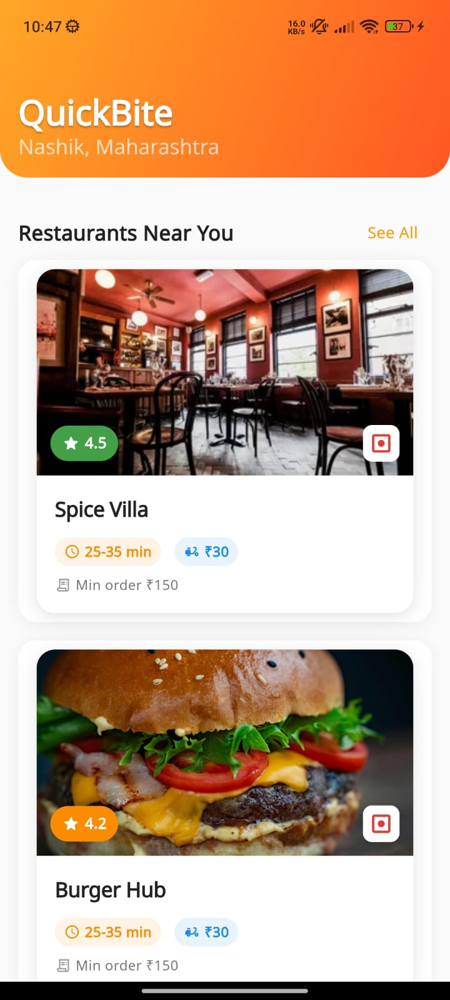
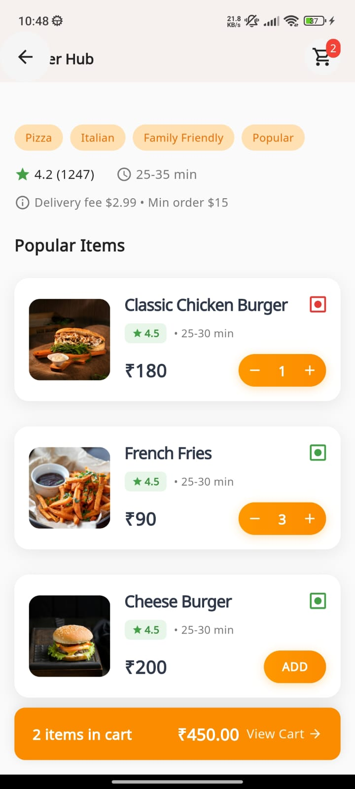
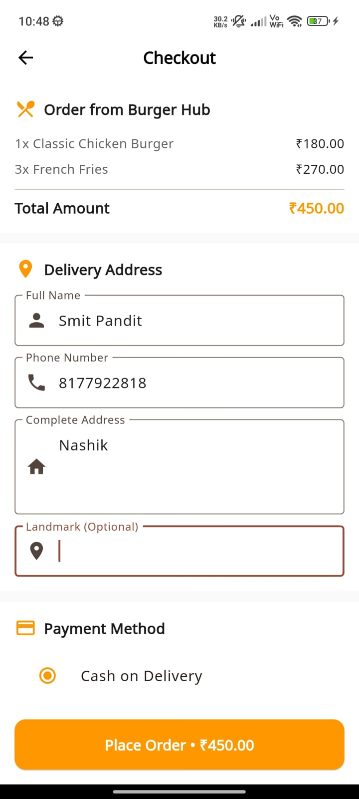
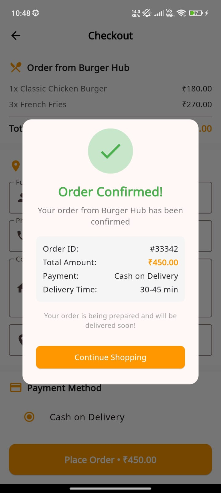

# Food Ordering Workflow (Flutter + BloC)

A food ordering workflow app built with Flutter using BloC state management.

## 📸 Screenshots

### Home Screen


### Restuarant Screen


### Order Details Screen
 

### Cart Screen


### Checkout Screen


### Order Confirmed Screen


## 🚀 Features
- Browse restaurants and menus
- Add/remove items to cart
- Checkout with address + payment
- Order confirmation screen
- BloC architecture
- Unit tests included

## 🛠️ How to Run
1. Clone the repo
   ```bash
   git clone https://github.com/smitpandit7/flutter_food_ordering_app.git

2. Install dependencies

    flutter pub get

3. Run the app on an emulator or connected device

    flutter run
